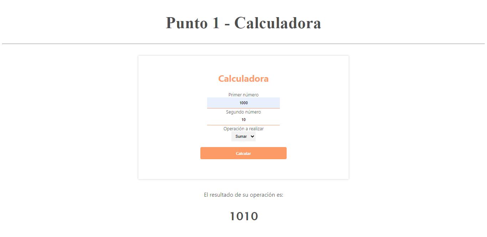
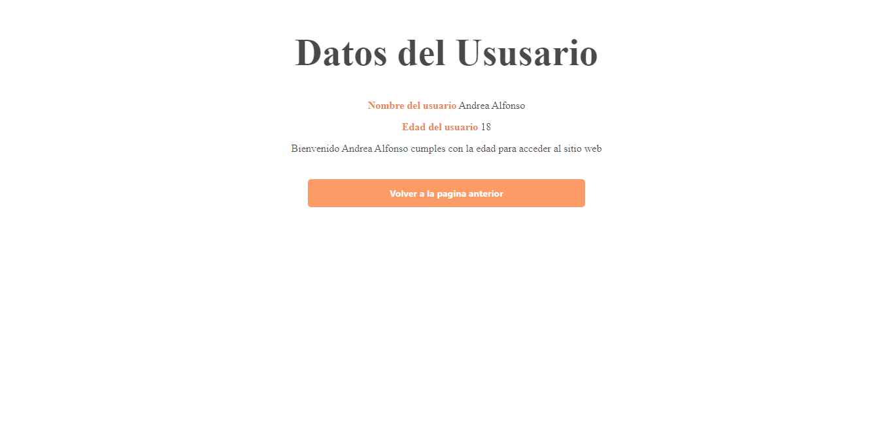
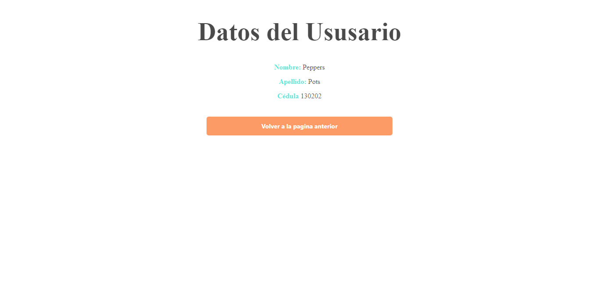
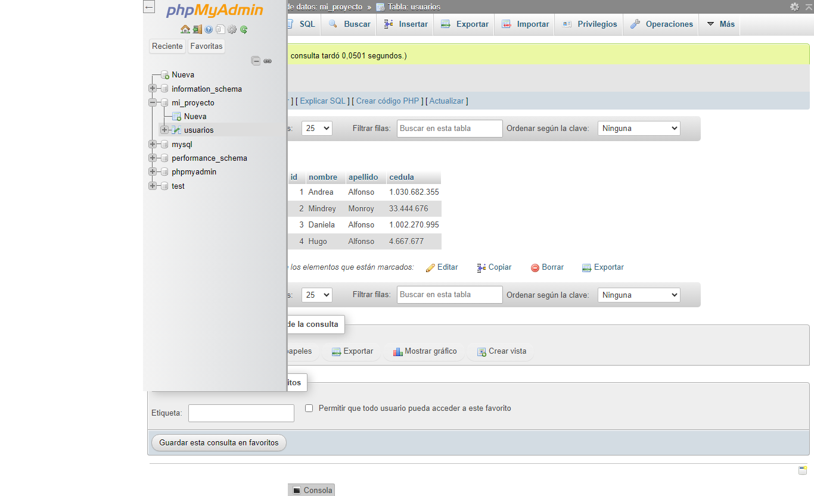
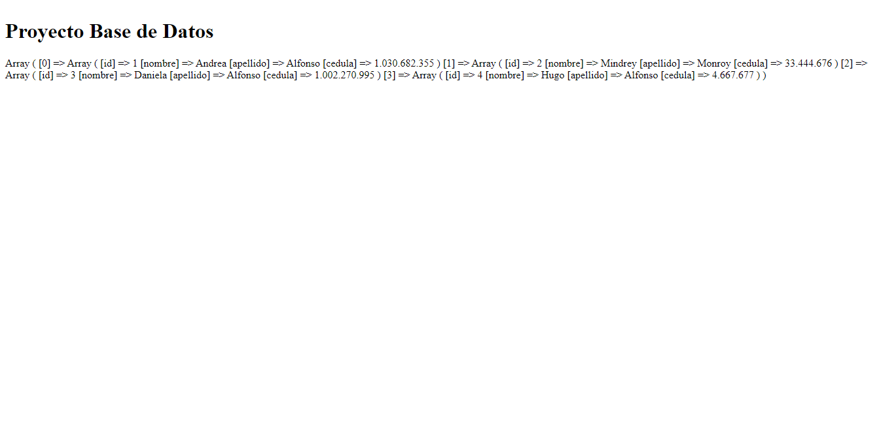
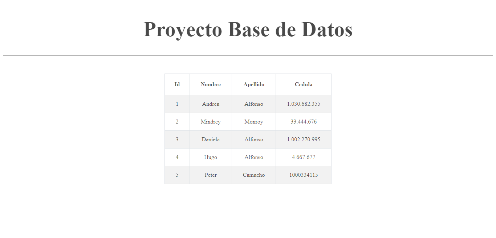

<h1>TALLER 10: Andrea Katerine Alfonso Monroy</h1>

<h2>Información</h2>

Curso: Full Stack Basico - Grupo 1

Profesor: Cristian Patiño

<h2>Punto 1: Calculadora</h2>

<h2>Punto 2: Verificador de edad</h2>

<h2>Punto 3: </h2>

<h2>Punto 4: </h2>

<h2>Punto 5-6-7: </h2>
<h3>5 - Base de datos</h3>

<h3>6 - Conexión</h3>

<h3>7 - Muestra de datos en pantalla</h3>

